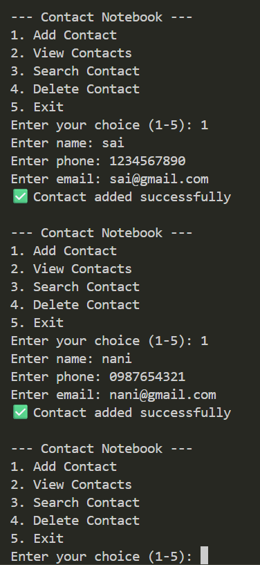
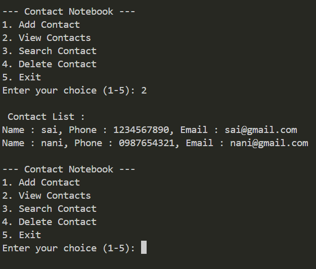
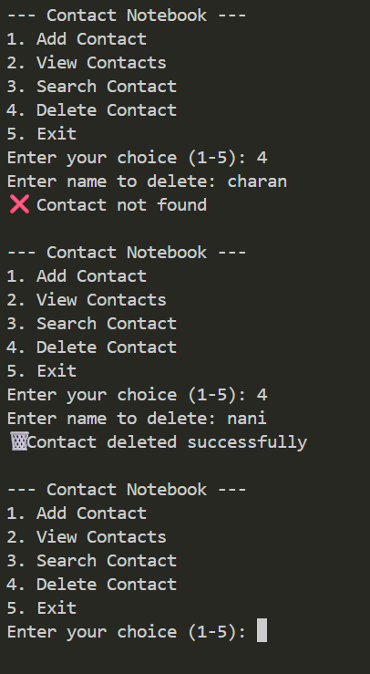

 # 📒Contact Notebook using Python (File Handling)
A simple Contact Notebook application built using Python that demonstrates file handling and CRUD operations.This project allows users to add, view, search, and delete contacts using a text file for storage.

# 🚀Features
-➕ Add new contacts
-📖 View all saved contacts
-🔍 Search contacts by name
-🗑️ Delete contacts
-💾 Persistent storage using file handling

# 📌How It Works
  =>Contact details are stored in contacts.txt
  =>Each contact is saved in the format: Name,Phone,Email

# 🎯Outcomes
✔️Understanding file handling in Python
✔️Building a menu-driven console application
✔️Improving logical thinking and problem-solving skills

# Expected output

